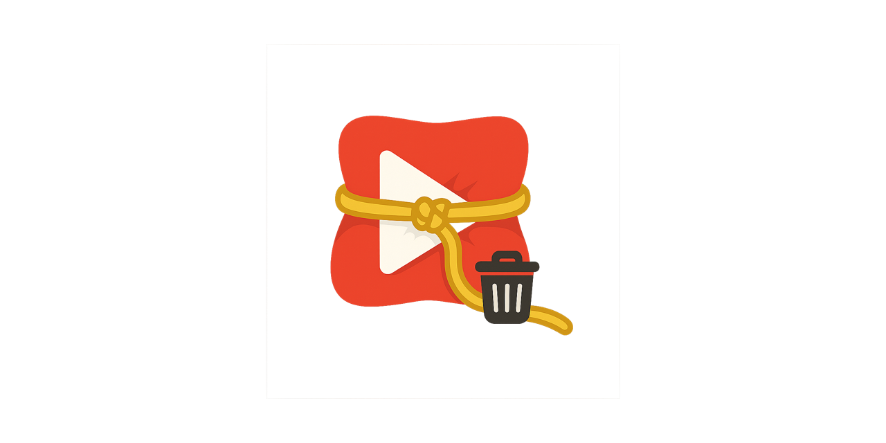

  

YouTube WatchLater Wrangler
================================

Select, manage, and bulk-remove videos from your YouTube Watch Later playlist. Built for large lists with fast selection (including “Select all – entire list”), cancel, pause/resume, shift‑click range, and an always-visible, minimal UI that blends with YouTube.

  

Features
- Select all (visible) and Select all (entire list) with live progress and Cancel.
- Shift‑click range selection between any two visible items.
- Invert selection for the currently visible items.
- Bulk remove with progress and Pause/Resume.
- Selection tracked by video ID (robust across YouTube re-rendering).
- Selection persists across refresh; unobtrusive one-time hint.
- Lightweight “Light mode” applied automatically during heavy ops (no UI toggle).

Install (Load Unpacked)
1) Open Chrome → `chrome://extensions`.
2) Toggle “Developer mode” (top-right).
3) Click “Load unpacked” and select this project folder (it must contain `manifest.json`).
4) Navigate to `https://www.youtube.com/playlist?list=WL`.

Usage
- A compact bar appears on the right under the masthead:
  - Title: “YouTube WatchLater Wrangler” (double‑click to clear selection).
  - Pills: “Select all (visible)”, “Invert”, “Select all (entire)”, “Remove (N)” and during removal a “Pause/Resume” pill.
- “Select all (entire)” scrolls to load your full list; click again to Cancel mid‑way.
- “Remove (N)” deletes the selected videos sequentially with a safety delay.

Tips
- Large lists: the extension automatically reduces overhead during heavy operations; checkboxes are only injected for visible rows while selecting everything or removing.
- If YouTube’s UI re-renders while you scroll, selection is preserved by ID and checkboxes resync as rows reappear.

Permissions
- `activeTab` only. No network requests, no analytics, no external dependencies.
- Content script runs on `*://www.youtube.com/*` but self-activates only on `playlist?list=WL`.

How it works (technical)
- Injects a small fixed header (UI) and attaches a per‑item checkbox overlay in the Watch Later playlist.
- Selection uses video IDs (parsed from thumbnail links); checkboxes reflect selection state on mutation.
- “Select all (entire)” auto‑scrolls until the list stops growing for several cycles, selecting each newly-rendered item.
- Removal simulates the user’s menu interactions; the “Remove from Watch later” entry is detected via endpoint/command analysis with multilingual text fallback.

Troubleshooting
- UI not visible: hard refresh the WL page (Cmd/Ctrl+Shift+R). Ensure the extension is enabled in `chrome://extensions`.
- The bar overlaps YouTube’s banner X: it should nudge below/away automatically; if not, refresh once.
- Selection seems slow after ~1000 items: normal for large DOMs; the extension lowers overhead during heavy ops to keep scrolling responsive.
- Menu not found on removal: switch YouTube language to English to test; if that works, the endpoint match likely needs tuning for your locale — open DevTools and share console logs.

Publish to Chrome Web Store
1) Prepare assets:
   - Icons (PNG): 16×16, 32×32, 48×48, 128×128 (add under `Images/` and reference via `icons` in `manifest.json`).
   - Screenshots: 1280×800 or 640×400 (at least 1, up to 5), JPG/PNG.
   - Optional promo image: 1400×560.
2) Version bump:
   - Update `version` in `manifest.json` (e.g., `1.1.0`).
3) Package:
   - Zip the extension root containing `manifest.json`, `content.js`, `styles.css`, and any `Images/` icons.
4) Submit:
   - Go to `https://chrome.google.com/webstore/devconsole` (one‑time developer registration required).
   - Create a new item → upload zip → fill listing details: name, description, category, privacy disclosure (no data collection), screenshots, and support URL (your GitHub repo).
   - Request publication (it may take some hours to days for review).

Repo structure
- `manifest.json` — MV3 manifest, scoped to YouTube.
- `content.js` — UI, selection, deletion logic (no external libs).
- `styles.css` — compact header/pills/modal/toast styling.
- `Images/` — place your icons here (optional but required for store listing).

Development
- No build step required. Edit `content.js` / `styles.css`, then refresh the Watch Later page.
- To reset the in‑page hint: remove `wlbm_hint_shown` from localStorage.
- To reset persisted selections: remove `wlbm_selected_ids` from localStorage.

Privacy & data collection
- No data is sent anywhere. Everything runs locally on the Watch Later page.

License
- © 2025 Jonathan Foye. All rights reserved. (Adjust if you plan to open‑source.)

Changelog (excerpt)
- 1.0: Initial release — header UI, per‑item selection, Select all (visible), bulk removal with delay.
- 1.1: Select all (entire) with Cancel + progress; Pause/Resume; shift‑click range, invert (visible), locale‑agnostic removal; selection persistence; auto Light mode during heavy ops.
